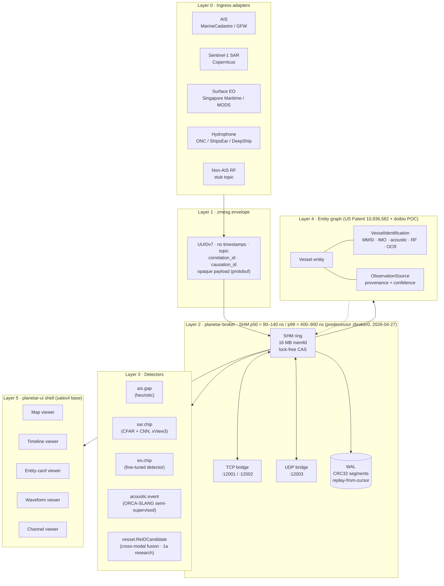
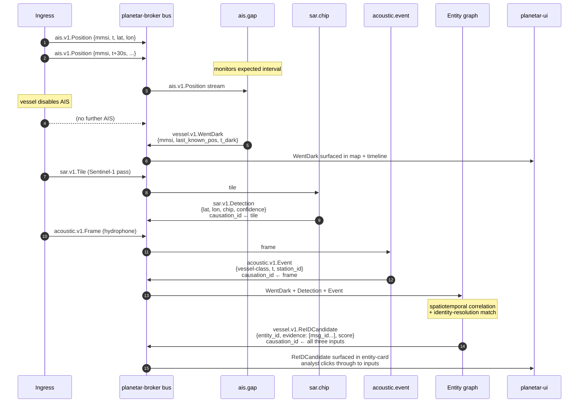
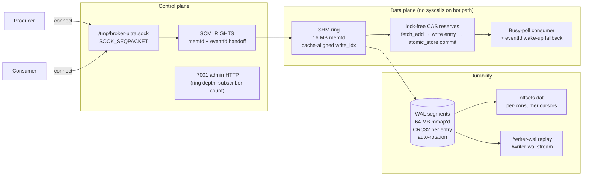
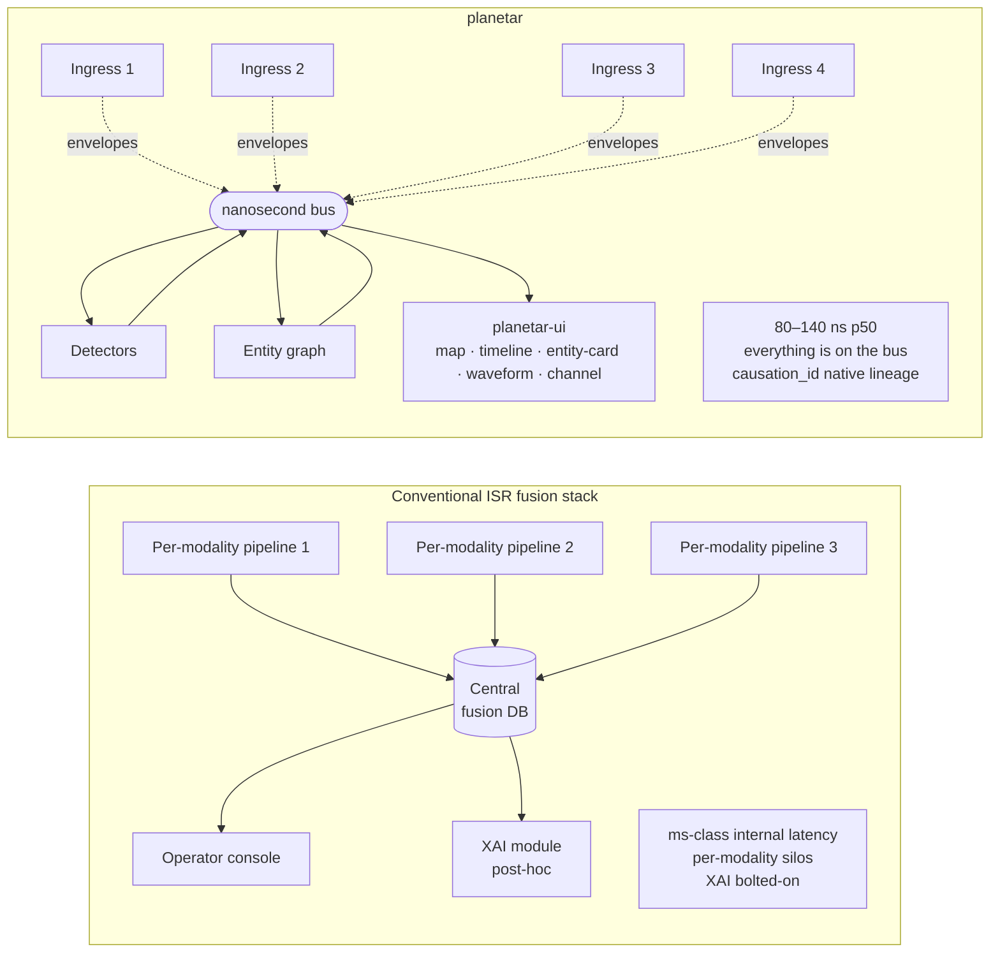

# Architecture Diagrams

Mermaid source for diagrams referenced in the bid. Renders inline on GitHub, GitLab, Obsidian, VS Code, and most modern markdown viewers.

The ASCII version of (1) lives in `03-ARCHITECTURE.md` for portability. These Mermaid versions are for reviewer-facing decks, the proposal cover-page (if a graphic is requested at contract negotiation), and the 1b proposal package.

---

## (1) System overview — five layers

The five-layer composition is the architectural thesis. Every component in the system is on the bus; nothing talks directly.

The dotted line from Graph back to SHM is the **write-back**: when the entity graph publishes `vessel.v1.ReIDCandidate`, that publication is itself a bus message — the shell renders it, the WAL records it, and reviewers can reconstruct graph state at any historical `t`.

---

## (2) Dark-vessel scenario — concrete data flow

The flagship 1a demonstration, expressed as a sequence of typed bus messages with `causation_id` lineage.

Step (12) — `vessel.v1.ReIDCandidate` — is the system's output. The analyst sees one candidate entity with a list of evidence messages; clicking any of them traces back through `causation_id` to the raw input envelope. **Native lineage, not post-hoc XAI.**

---

## (3) Bus internals — control plane vs data plane

**Control-plane and data-plane separation is what delivers nanosecond latency on the data path.** Connection / subscription / fd-handoff happens once via a Unix socket; thereafter, everything is direct memory access.

---

## (4) Comparison — planetar vs. conventional ISR fusion stack

The **same architectural decision** — every component is a bus participant, nothing else — eliminates the silos, the fusion-DB bottleneck, and the bolted-on XAI in one move.

---

## Rendering notes

- All four diagrams render natively on **GitHub** without configuration.
- For the proposal package (if a graphic is requested at contract negotiation), export to SVG via Mermaid CLI: `mmdc -i architecture-diagrams.md -o diagrams.svg`.
- Diagram (1) has an ASCII-art twin in `03-ARCHITECTURE.md` for portability when SVG / Mermaid isn't available.

## Cross-references

- Layer-by-layer prose: `03-ARCHITECTURE.md`.
- Bus measurement: `docs/benchmark-2026-04-27.md`.
- Detector definitions and topic schemas: `03-ARCHITECTURE.md` Layer 3.
- doibio entity-graph lineage: `03-ARCHITECTURE.md` Layer 4.
